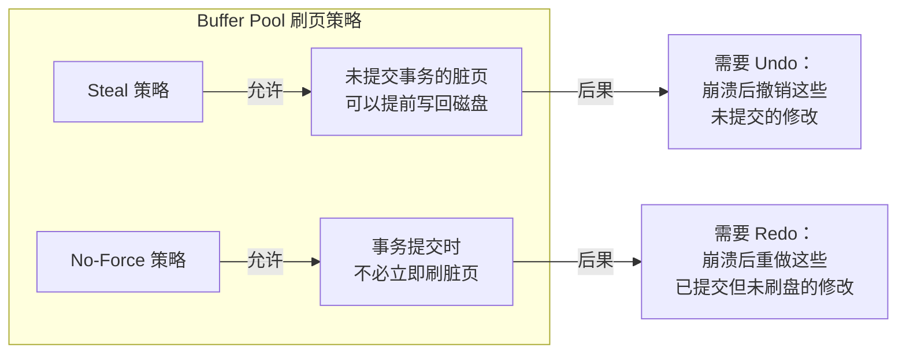
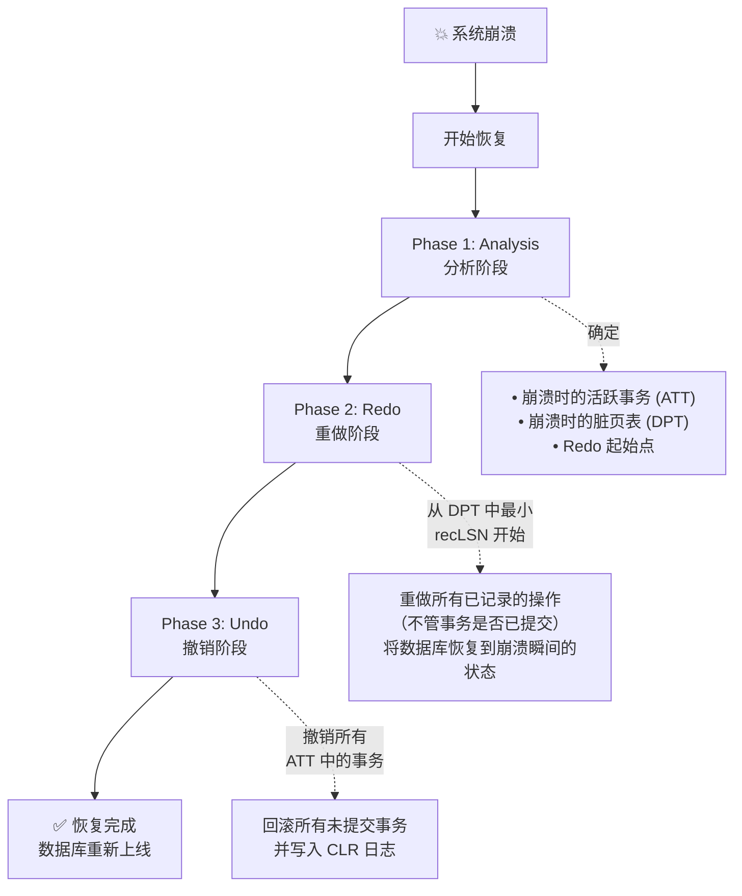
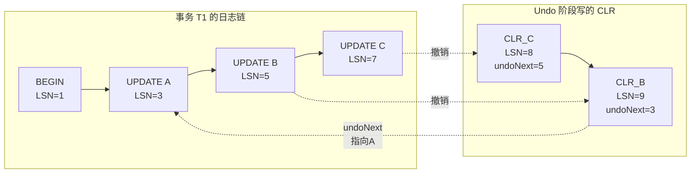
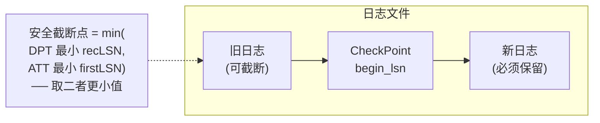
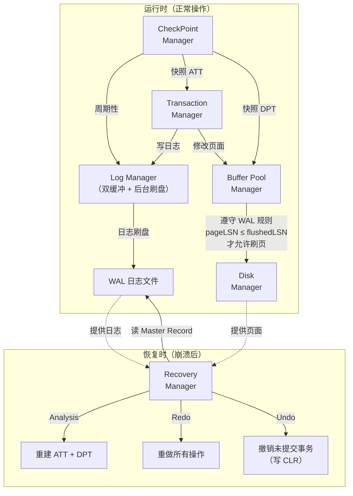

# Recovery Manager 与 CheckPoint 机制完整设计分析

## 一、当前简化实现 vs 真实数据库的差距

### 当前 MiniSQL 的简化

| 维度 | 当前简化实现 | 真实数据库 |
|------|-------------|-----------|
| 数据模型 | KV 内存 map (`unordered_map<string, int>`) | 基于磁盘页 (Page) 的存储 |
| 日志存储 | 内存 `std::map<lsn_t, LogRecPtr>` | 磁盘上的 WAL 日志文件 |
| CheckPoint | 全量快照 (`KvDatabase`) | 增量式 Fuzzy Checkpoint |
| Redo 粒度 | 逻辑操作（Key-Value 级别） | 物理操作（Page 级别，`page_id` + offset） |
| 页面 LSN | 不存在 | 每个 Page 都有 `pageLSN` |
| 脏页追踪 | 不存在 | Dirty Page Table (DPT) |
| 日志刷盘策略 | 不涉及（全内存） | WAL + Force-at-Commit |
| Buffer Pool 协调 | 不涉及 | Steal/No-Force 策略，与 BPM 紧密耦合 |

> [!NOTE]
> 当前实现中 [Page](file:///home/lhc/minisql/src/include/page/page.h#L54-L57) 已经预留了 `GetLSN()` / `SetLSN()` 接口，这正是为真实恢复机制做的准备。

---

## 二、真实 Recovery Manager 的设计（基于 ARIES 协议）

### 2.1 核心原则：WAL（Write-Ahead Logging）

WAL 是整个恢复机制的基石，包含两条铁律：

```
规则 1 (Undo Rule)：在脏页写回磁盘之前，该页上所有修改对应的日志记录
        必须先刷到磁盘日志文件中。（即 pageLSN ≤ flushedLSN 才允许刷页）

规则 2 (Redo Rule)：事务 Commit 返回给用户之前，该事务的所有日志记录
        （包括 Commit 记录本身）必须先刷到磁盘日志文件。（Force-at-Commit）
```

### 2.2 Steal / No-Force 策略



> [!IMPORTANT]
> **Steal + No-Force** 是现代数据库的标准选择，因为它提供了最好的运行时性能（不用等脏页刷盘），但代价是恢复逻辑更复杂——同时需要 Redo 和 Undo。

### 2.3 日志记录的物理设计

在真实数据库中，日志记录需要**序列化到磁盘**，而非存储在内存 `shared_ptr` 中：

```cpp
// 真实的日志记录——物理格式（序列化到字节流）
struct LogRecord {
    // ========== Header（固定大小） ==========
    uint32_t size_;          // 整条日志记录的字节大小
    lsn_t    lsn_;           // Log Sequence Number
    txn_id_t txn_id_;        // 事务 ID
    lsn_t    prev_lsn_;      // 同一事务的上一条日志 LSN
    LogRecType type_;        // 日志类型
    
    // ========== Body（根据类型变化） ==========
    // 对于 Insert / Delete / Update：
    page_id_t page_id_;      // 修改的页面 ID
    uint16_t  offset_;       // 页面内的偏移量
    uint16_t  old_data_len_; // 旧数据长度
    uint16_t  new_data_len_; // 新数据长度
    char      data_[];       // old_data + new_data（变长部分）
    
    // 序列化 / 反序列化方法
    uint32_t SerializeTo(char *buf) const;
    static LogRecord DeserializeFrom(const char *buf);
};
```

> [!TIP]
> 注意与当前实现的关键区别：真实日志记录的是 **物理级别** 的操作——"在 page_id=5、offset=120 处，将 `old_bytes` 替换为 `new_bytes`"，而非逻辑级别的 "插入 key=Alice, val=100"。物理日志使 Redo/Undo 具有 **幂等性**。

### 2.4 LogManager 的完整设计

```cpp
class LogManager {
public:
    // 追加一条日志记录到 log buffer，返回其 LSN
    lsn_t AppendLogRecord(LogRecord &log_record);
    
    // 将 log buffer 中的日志刷到磁盘文件
    void Flush();
    
    // 后台线程：周期性刷盘或 buffer 满时触发
    void FlushThread();
    
    // 获取当前已持久化到磁盘的最大 LSN
    lsn_t GetPersistentLSN() const { return persistent_lsn_; }

private:
    // ---- 双缓冲设计（减少 I/O 等待） ----
    char *log_buffer_;         // 当前写入的缓冲区
    char *flush_buffer_;       // 正在刷盘的缓冲区
    
    lsn_t next_lsn_;           // 下一个可分配的 LSN
    lsn_t persistent_lsn_;    // 已刷盘的最大 LSN（flushedLSN）
    
    std::mutex latch_;
    std::condition_variable cv_;  // 用于唤醒刷盘线程
    std::thread flush_thread_;
    
    FILE *log_file_;            // WAL 日志文件句柄
};
```

**双缓冲机制**（Double Buffering）的核心思想：

```
┌─────────────────┐     swap      ┌──────────────────┐
│   log_buffer_   │  ◄──────────► │  flush_buffer_   │
│  (事务写入端)    │               │  (磁盘 I/O 端)    │
└─────────────────┘               └──────────────────┘
        │                                   │
   事务线程持续往                        后台线程将其
   这里追加日志                         写入磁盘文件
```

当 `log_buffer_` 满了或者需要强制刷盘（如事务 commit）时：
1. **交换** `log_buffer_` 和 `flush_buffer_` 的指针
2. 事务线程可以**立即**继续写入新的 `log_buffer_`
3. 后台线程将旧的 `flush_buffer_` 内容写入磁盘

---

## 三、完整的 Recovery 流程：ARIES 三阶段

### 3.1 整体流程



### 3.2 Phase 1: Analysis（分析阶段）

从最后一个 CheckPoint 开始，正向扫描日志：

```cpp
void RecoveryManager::AnalysisPhase() {
    // 1. 从 CheckPoint 记录中恢复 ATT 和 DPT
    active_txns_ = checkpoint.active_txns_;    // Active Transaction Table
    dirty_pages_ = checkpoint.dirty_pages_;    // Dirty Page Table
    
    // 2. 从 CheckPoint 之后的日志开始正向扫描
    for (auto lsn = checkpoint_lsn; lsn <= end_of_log; lsn++) {
        LogRecord rec = ReadLogRecord(lsn);
        
        if (rec.type == BEGIN || rec.type == UPDATE || rec.type == INSERT || rec.type == DELETE) {
            // 加入或更新 ATT
            active_txns_[rec.txn_id] = {rec.lsn, RUNNING};
        }
        
        if (rec.type == UPDATE || rec.type == INSERT || rec.type == DELETE) {
            // 如果该页不在 DPT 中，加入 DPT
            // recLSN = 该页第一次被弄脏时的 LSN
            if (dirty_pages_.find(rec.page_id) == dirty_pages_.end()) {
                dirty_pages_[rec.page_id] = rec.lsn;  // recLSN
            }
        }
        
        if (rec.type == COMMIT || rec.type == ABORT) {
            // 从 ATT 中移除（已结束的事务）
            active_txns_.erase(rec.txn_id);
        }
        
        if (rec.type == END) {
            active_txns_.erase(rec.txn_id);
        }
    }
    // 分析完毕：ATT 中剩下的就是需要 Undo 的事务
    //          DPT 中最小的 recLSN 就是 Redo 的起始点
}
```

**关键数据结构**：

| 数据结构 | 内容 | 用途 |
|---------|------|------|
| **ATT** (Active Transaction Table) | `{txn_id → (lastLSN, status)}` | 追踪崩溃时仍在运行的事务 |
| **DPT** (Dirty Page Table) | `{page_id → recLSN}` | 追踪可能未刷盘的脏页，`recLSN` 是该页第一次被弄脏的 LSN |

### 3.3 Phase 2: Redo（重做阶段）

从 DPT 中最小的 `recLSN` 开始正向扫描，重做所有操作：

```cpp
void RecoveryManager::RedoPhase() {
    // Redo 起点 = DPT 中最小的 recLSN
    lsn_t redo_start = MinRecLSN(dirty_pages_);
    
    for (auto lsn = redo_start; lsn <= end_of_log; lsn++) {
        LogRecord rec = ReadLogRecord(lsn);
        
        // 只处理数据修改类日志
        if (rec.type != UPDATE && rec.type != INSERT && rec.type != DELETE && rec.type != CLR)
            continue;
        
        // ===== 三重过滤条件（避免不必要的重做） =====
        
        // 条件 1: 该页是否在 DPT 中？
        if (dirty_pages_.find(rec.page_id) == dirty_pages_.end())
            continue;
        
        // 条件 2: 该日志的 LSN 是否 >= 该页的 recLSN？
        if (rec.lsn < dirty_pages_[rec.page_id])
            continue;
        
        // 条件 3: 读取磁盘上的 pageLSN，判断是否已经应用过
        Page *page = buffer_pool_->FetchPage(rec.page_id);
        if (page->GetLSN() >= rec.lsn) {
            // 该修改已经持久化了，跳过
            buffer_pool_->UnpinPage(rec.page_id, false);
            continue;
        }
        
        // ===== 执行 Redo =====
        // 将日志中的 new_data 写入到页面的指定 offset
        memcpy(page->GetData() + rec.offset, rec.new_data, rec.new_data_len);
        page->SetLSN(rec.lsn);
        buffer_pool_->UnpinPage(rec.page_id, true);
    }
}
```

> [!WARNING]
> Redo 阶段**不区分事务是否已提交**——所有操作都会被重做。这是因为 Redo 的目的是将数据库恢复到崩溃瞬间的精确状态（包括未提交事务的修改）。未提交事务会在 Undo 阶段被撤销。

### 3.4 Phase 3: Undo（撤销阶段）

从 ATT 中所有活跃事务的 `lastLSN` 开始，反向回滚：

```cpp
void RecoveryManager::UndoPhase() {
    // 用最大堆管理所有需要 Undo 的 LSN
    // （从最新的操作开始往回撤销，与当前简化实现的思路一致）
    std::priority_queue<lsn_t> undo_list;
    
    for (auto &[txn_id, info] : active_txns_) {
        undo_list.push(info.last_lsn);
    }
    
    while (!undo_list.empty()) {
        lsn_t undo_lsn = undo_list.top();
        undo_list.pop();
        
        LogRecord rec = ReadLogRecord(undo_lsn);
        
        if (rec.type == CLR) {
            // CLR（补偿日志）：跳到 undoNextLSN
            if (rec.undo_next_lsn != INVALID_LSN) {
                undo_list.push(rec.undo_next_lsn);
            } else {
                // 该事务已完全回滚，写入 END 日志
                WriteEndRecord(rec.txn_id);
            }
            continue;
        }
        
        // ===== 撤销操作并写 CLR =====
        Page *page = buffer_pool_->FetchPage(rec.page_id);
        
        // 将 old_data 写回页面
        memcpy(page->GetData() + rec.offset, rec.old_data, rec.old_data_len);
        
        // 写一条 CLR（Compensation Log Record）日志
        LogRecord clr;
        clr.type = CLR;
        clr.txn_id = rec.txn_id;
        clr.page_id = rec.page_id;
        clr.undo_next_lsn = rec.prev_lsn;  // 指向下一个需要 Undo 的日志
        // CLR 中也记录了这次物理修改的内容（使 CLR 可以被 Redo）
        clr.new_data = rec.old_data;  // "新值"就是"原来的旧值"
        lsn_t clr_lsn = log_manager_->AppendLogRecord(clr);
        
        page->SetLSN(clr_lsn);
        buffer_pool_->UnpinPage(rec.page_id, true);
        
        // 将 prev_lsn 加入 Undo 列表
        if (rec.prev_lsn != INVALID_LSN) {
            undo_list.push(rec.prev_lsn);
        } else {
            WriteEndRecord(rec.txn_id);
        }
    }
}
```

### 3.5 CLR（Compensation Log Record）的关键作用

> [!IMPORTANT]
> **CLR 是 ARIES 最精妙的设计之一**。它解决了一个关键问题：如果在 Undo 阶段又发生崩溃怎么办？

```
场景：事务 T1 执行了操作 A → B → C，然后崩溃

第一次恢复（Undo 阶段）：
  撤销 C → 写 CLR_C（undo_next = B 的 LSN）
  撤销 B → 写 CLR_B（undo_next = A 的 LSN）
  （此时又崩溃了！）

第二次恢复：
  Redo 阶段：会重做 CLR_C 和 CLR_B（它们也是日志！）
  Undo 阶段：看到 CLR_B 的 undo_next 指向 A
            → 直接跳到 A 开始 Undo，不会重复撤销 B 和 C
```



---

## 四、事务回滚（Runtime Abort）的设计

事务回滚不仅在恢复时发生，运行时也会发生（用户主动 ROLLBACK 或死锁检测导致 Abort）：

```cpp
void TransactionManager::Abort(Transaction *txn) {
    // 1. 沿着事务的日志链反向撤销
    lsn_t undo_lsn = txn->GetLastLSN();
    
    while (undo_lsn != INVALID_LSN) {
        LogRecord rec = log_manager_->ReadLogRecord(undo_lsn);
        
        if (rec.type == CLR) {
            // 跳到 undoNextLSN（之前的回滚已处理过的部分）
            undo_lsn = rec.undo_next_lsn;
            continue;
        }
        
        // 撤销物理修改
        Page *page = buffer_pool_->FetchPage(rec.page_id);
        memcpy(page->GetData() + rec.offset, rec.old_data, rec.old_data_len);
        
        // 写 CLR 日志（保证即使回滚过程中崩溃也能恢复）
        LogRecord clr = CreateCLR(rec, rec.prev_lsn);
        lsn_t clr_lsn = log_manager_->AppendLogRecord(clr);
        page->SetLSN(clr_lsn);
        
        buffer_pool_->UnpinPage(rec.page_id, true);
        undo_lsn = rec.prev_lsn;
    }
    
    // 2. 写 ABORT 日志
    log_manager_->AppendLogRecord(CreateAbortLog(txn->GetTxnId()));
    
    // 3. 强制刷盘
    log_manager_->Flush();
    
    // 4. 写 END 日志
    log_manager_->AppendLogRecord(CreateEndLog(txn->GetTxnId()));
    
    // 5. 释放所有锁
    lock_manager_->UnlockAll(txn);
}
```

> [!TIP]
> 运行时回滚与恢复时 Undo 阶段的逻辑几乎完全相同——都是沿 `prev_lsn` 链反向遍历并写 CLR。这体现了 ARIES 设计的优雅之处。

---

## 五、CheckPoint 机制的完整设计

### 5.1 为什么需要 CheckPoint？

```
如果没有 CheckPoint：
  每次恢复都要从日志文件的第一条记录开始扫描
  → 日志文件可能有数 GB 甚至数 TB
  → 恢复时间不可接受

有了 CheckPoint：
  恢复只需从最后一个 CheckPoint 开始
  → 大幅缩短恢复时间
  → CheckPoint 之前的日志可以安全截断
```

### 5.2 三种 CheckPoint 策略对比

| 策略 | 实现方式 | 优点 | 缺点 |
|------|---------|------|------|
| **Consistent Checkpoint** | 停止所有事务，刷所有脏页到磁盘，写 CheckPoint 记录 | 恢复简单 | **必须暂停整个数据库**，不可接受 |
| **当前 MiniSQL 实现** | 全量快照 KvDatabase 到 CheckPoint | 测试方便 | 不适用于基于磁盘页的真实数据库 |
| **Fuzzy Checkpoint (ARIES)** | 不暂停事务，只记录 ATT 和 DPT 的快照 | **无需暂停数据库** | 恢复稍复杂 |

### 5.3 Fuzzy Checkpoint 的完整设计

```cpp
class CheckPointManager {
public:
    // 由后台线程周期性调用（如每 5 分钟或每 N 条日志后）
    void CreateCheckPoint() {
        // ===== Step 1: 写 BEGIN_CHECKPOINT 日志 =====
        lsn_t begin_lsn = log_manager_->AppendLogRecord(
            CreateBeginCheckpointLog()
        );
        
        // ===== Step 2: 获取 ATT 和 DPT 的一致性快照 =====
        // 需要短暂加锁（只锁数据结构，不锁事务执行）
        ATT att_snapshot;
        DPT dpt_snapshot;
        {
            std::lock_guard<std::mutex> lock(txn_manager_->GetLatch());
            att_snapshot = txn_manager_->GetActiveTxnTable();
        }
        {
            std::lock_guard<std::mutex> lock(buffer_pool_->GetLatch());
            dpt_snapshot = buffer_pool_->GetDirtyPageTable();
        }
        
        // ===== Step 3: 写 END_CHECKPOINT 日志（携带 ATT + DPT） =====
        lsn_t end_lsn = log_manager_->AppendLogRecord(
            CreateEndCheckpointLog(att_snapshot, dpt_snapshot)
        );
        
        // ===== Step 4: 将 begin_lsn 写入 Master Record =====
        // Master Record 是磁盘上一个固定位置，记录最后一个 CheckPoint 的 LSN
        WriteMasterRecord(begin_lsn);
        
        // ===== Step 5: 强制刷盘 =====
        log_manager_->Flush();
        
        // ===== Step 6: 日志截断（可选） =====
        // 可以安全删除 min(DPT 中最小 recLSN, ATT 中最小 firstLSN) 之前的日志
        TruncateLogBefore(ComputeSafeTruncatePoint(att_snapshot, dpt_snapshot));
    }

private:
    LogManager *log_manager_;
    TransactionManager *txn_manager_;
    BufferPoolManager *buffer_pool_;
};
```

### 5.4 Fuzzy Checkpoint 的时间线

```
时间线：
   ──────────────────────────────────────────────────────────►
                    │                        │
              BEGIN_CHECKPOINT          END_CHECKPOINT
                    │                        │
                    │   ┌─ 这段时间内 ──┐     │
                    │   │ 事务继续执行   │     │
                    │   │ 新的日志继续写 │     │
                    │   │ 脏页继续产生   │     │
                    │   └──────────────┘     │
                    │                        │
                    │  ATT 和 DPT 是在       │
                    │  这段期间某个时刻       │
                    │  拍的快照               │
```

> [!IMPORTANT]
> Fuzzy Checkpoint 的关键优势：**事务完全不需要暂停**。`BEGIN_CHECKPOINT` 和 `END_CHECKPOINT` 之间，数据库正常处理所有事务。唯一需要的"暂停"只是获取 ATT 和 DPT 数据结构的一把短锁。

### 5.5 Master Record

```
Master Record（磁盘上固定位置，如日志文件的第一个 block）:
  ┌──────────────────────────┐
  │ last_checkpoint_lsn: 857 │  ← 恢复时从这里开始
  └──────────────────────────┘
```

恢复时：
1. 读 Master Record → 得到最后 CheckPoint 的 `begin_lsn`
2. 读该 LSN 处的 `BEGIN_CHECKPOINT` → 找到对应的 `END_CHECKPOINT`
3. 从 `END_CHECKPOINT` 中恢复 ATT 和 DPT
4. 从 `begin_lsn` 开始执行 Analysis 阶段

### 5.6 日志截断



安全截断点 = `min(DPT 中最小的 recLSN, ATT 中最小的 firstLSN)`

- **DPT 最小 recLSN**：Redo 最远可能需要回溯的位置
- **ATT 最小 firstLSN**：Undo 最远可能需要回溯的位置

---

## 六、各模块协作全景图



---

## 七、与当前 MiniSQL 实现的对照总结

以你当前实现的 [RecoveryManager](file:///home/lhc/minisql/src/include/recovery/recovery_manager.h) 为参照：

| 你的实现 | 完整 ARIES 实现 | 差异原因 |
|---------|----------------|---------|
| `RedoPhase()` 遍历内存 map | 从磁盘 WAL 文件正向扫描 | 简化为内存模型 |
| Redo 时跳过 `lsn < persist_lsn_` | 跳过 `lsn < recLSN` 且 `pageLSN >= lsn` | 缺少 DPT 和 pageLSN 机制 |
| `UndoPhase()` 使用 `priority_queue` | 同样使用最大堆（**一致** ✅） | 思路完全正确 |
| `ApplyUndo()` 直接修改 KV map | 修改磁盘页 + 写 CLR | 缺少 CLR 机制 |
| Abort 在 Redo 阶段直接回滚 | Abort 事务在 Undo 阶段处理 | 简化处理 |
| CheckPoint 包含全量数据快照 | CheckPoint 只包含 ATT + DPT | 全量快照不可扩展 |
| [LogManager](file:///home/lhc/minisql/src/include/recovery/log_manager.h) 为空类 | 完整的双缓冲日志管理器 | 预留扩展接口 |
| [Page::GetLSN()](file:///home/lhc/minisql/src/include/page/page.h#L54) 已预留 | 用于 Redo 阶段判断是否需要重做 | 已有基础设施 |

> [!TIP]
> 你当前 `UndoPhase()` 中使用最大堆按 LSN 倒序回滚的设计与 ARIES 标准实现完全一致，这是最核心的思路。主要缺失的是：(1) CLR 日志保证 Undo 的幂等性；(2) DPT + pageLSN 优化 Redo 性能；(3) Fuzzy Checkpoint 替代全量快照。
