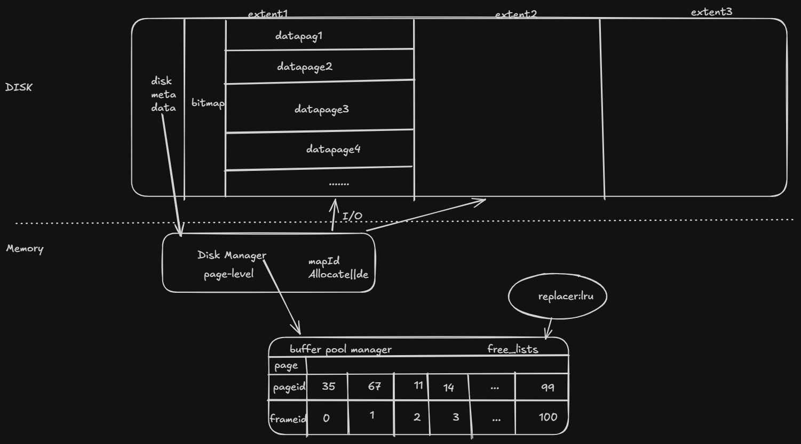
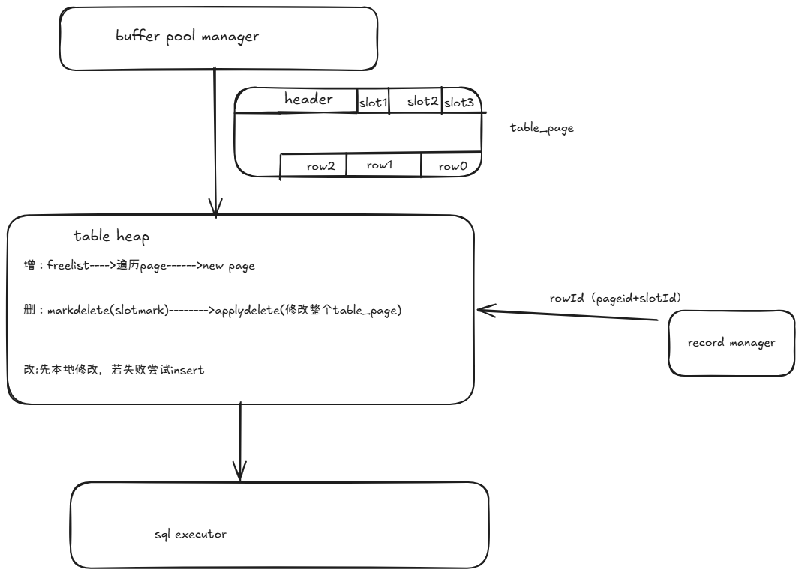
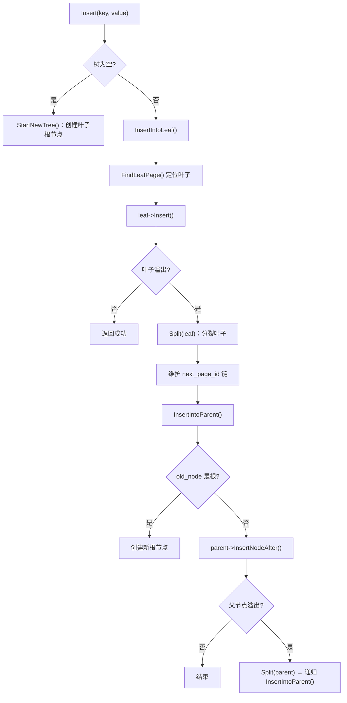
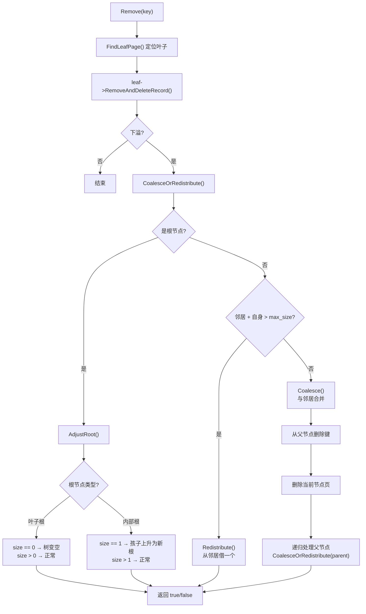
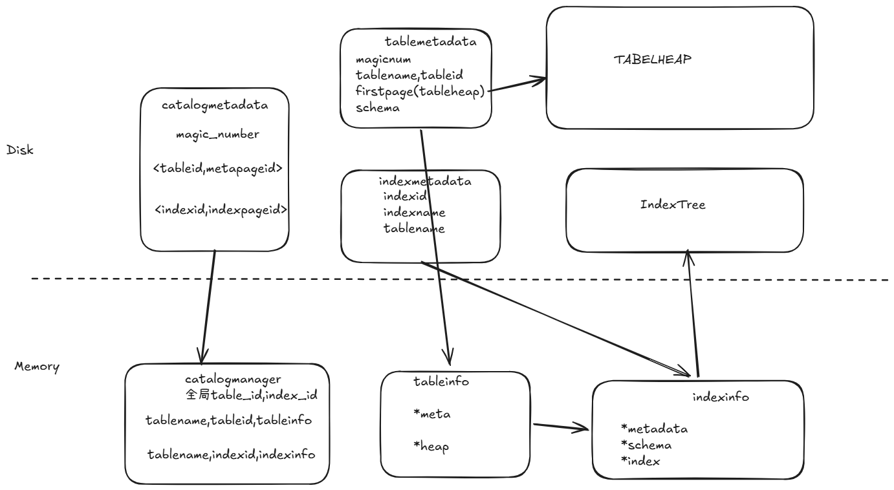

# 数据库实验报告
# DISK AND BUFFER POOL MANAGER
这一层的整体架构

## 数据结构
在disk上，存储了三种page数据。前两者是为了方便管理索引。
* 第一个，是metadata，格式为| num_allocated_pages_ | num_extents_ | extent_used_page_[0]... |
* 第二个是每个extent的bitmap page ，格式为:| page_allocated | next_free_page | bytes[PAGESIZE-2*4] |
* 第三个是具体的datapage，其为基类，后续会根据存储的内容分为不同的数据页
## disk manager
其负责page级别的i/o读写，因此具有了一些职责:
* 找一个空闲页
* 分配一个新的page
* 删除page
* 判断page是否为空
注意的是，这里只负责分配删除的逻辑，是page-level的，不会涉及具pagedata.
这样，对其上层，只需要传一个logicId即可，隐层了物理层次的细节。
## buffer pool
其核心，是维护了一个内存池。
任何一个page进入内存后，都需要标记page_id,pin_count,is_dirty

* pin_count代表了有多少线程在使用当前page，当pin_count>0时，不会被删除或者置换

* is_dirty是page的脏页逻辑。我们在修改page后，不会立即io写入，而是标记为dirty，当发生flushpage或者从内存池驱逐或者整个内存池发生析构时，写入disk。
* FetchPage：不在内存池要从disk取，然后找到对应的位置，或者驱逐
* deletepage，删除page只需要在bitmap中标记不可用即可。另外就是，因为不会再用，可以直接从replacer中驱逐。
* 关于lru，采用了一个双向链表和hash来加快查找速度
* bitmap查找的优化上，采用了next_free_page_。其值是上一次释放后的最小值。但效果不明显。
* 注意logicId与physicalId间的map
* diskmanager的扩容机制:先更新metedata，再新建一个bitmap，标记第一个为1，返回对应的logic_page_id
* 此外，如果出现缓存池满了且全部pin住的情况，bufferpool的NewPage和FetchPage返回的是nullptr。所以上层要先检验，然后只能abort.


# RECORD MANAGER
record manager是与index manager同一个层次的组件。两者通过rowId相互关联。
这里提供row-level的操作.
## table_page
我们此处对page里的data_[4096]使用的是table_page,
也就是slotted_page的形式，其结构如下
* Page Header（页头）：固定大小（24字节），存储了此页的 PageId、上/下一页的指针（构成双链表）、TupleCount（元组数量）和 FreeSpacePointer（空闲空间指针）。
* Slot Array（槽位数组）：紧跟页头。每存入一条记录，就会在这里追加 8 个字节的元信息（Tuple Offset 和 Tuple Size），告诉我们这条数据存放在页面的哪个位置、有多长。它的增长方向是从前往后。
* Tuple Data（真实的元组数据）：存放 Row 序列化后的二进制字节流。为了避免内存碎片，它从 4096 字节的尾部开始，由后往前分配。FreeSpacePointer 始终指向最新的（最靠前的）元组数据的起始位置。

## 如何把table写入disk page
对于Row，有field数组，采用bitmap来节省空间；此外，需要传递schema来确认每个数据的type；magic魔法数检验

## 堆表的tableheap
tableheap是一个page组成的双向链表

* 优化查询，加了一个freeList,
进入条件为:new page（只插入一个tuple），applydelete；
移除:插入失败

* inserttuple：先走freelist--->当前page链表---->new page

* 删除逻辑。三个delete函数是方便事务回滚。

    markdelete：标记删除,只在对应slot最高位上标记一个1即可  
applydelete:实际删除 ,需要移动数据来填充空洞
rollbackdelete:回滚删除，对于标记删除是方便回滚的。

* updatetuple:先原地更新，空间不够再insert更新

* deletetable:递归删除列表，有栈溢出的风险。

对上层封装了page层的细节，sql执行器不需要关系具体到哪个page
对堆表的iterator迭代，用了一个row* 一个tableheap*指针。
# INDEX MANAGER 
## page
这一层是不负责处理业务逻辑的，只有物理数据迁移。有两种page
* 基础类 b_plus_tree_page
定义了Header
 | PageType (4) | KeySize (4) | LSN (4) | CurrentSize (4) | MaxSize (4) | ParentPageId (4) | PageId(4) |
* BPlusTreeInternalPage
注意第一个key为invalid，只是为了维护键值对的形式.
| HEADER (28B) | KEY(1)+PAGE_ID(1) | KEY(2)+PAGE_ID(2) | ... | KEY(n)+PAGE_ID(n) |
需要实现的功能:
增:PopulateNewRoot()新增一个根节点   InsertNodeAfter()
删：remove
查：二分查找，左闭右开，Lookup
分裂，合并:MoveHalfTo()，旧的大小是minsize  MoveAllTo()

    注意到，这里a采用了双层管理机制
情况 A（当前页被修改）： InternalPage 只管改内存。由上一级的调用者（BPlusTree）负责在用完当前页后，统一调用 UnpinPage(current_page, true) 把它标记为脏页。
情况 B（连带子页面被修改）： InternalPage 在执行高级转移操作时，连带影响了不在上层掌控中的“子页面”。此时，InternalPage 必须自己充当临时调度员，借用 buffer_pool_manager 把子页面 Fetch 上来，改完后，立刻自己把子页面 Unpin 并标记为脏页。


* BPlusTreeLeafPage

    | HEADER (28B) | next_page_id (4B) | KEY(1)+RID(1) | KEY(2)+RID(2) | ...
    相比于内部节点，其维护的value是rowId.
此外，键是没有冗余的
也不需要bufferpage参与来管理子节点的继承问题
同时，节点间维护了一个单向链表


读代码时的一点思考，初始化时，为什么使用init而不采用默认构造函数呢？
我的理解是，这里的page实际是会不断被覆盖的。一个page的内存是之前就有的，是被buffer pool管理的，而不是这个构造函数自己开的。所以我们手动采用init去初始化才是正确的。


## b_Plus_tree 增删改查操作
有一颗INDEX_ROOTS_PAGE_ID，专门负责存储所有b+tree
初始化:从indexrootpage里面找
find:findpage+page里面找row
add:


delete： 

迭代器则是拿个指针即可，不赘述。


# CATALOG MANAGER 目录管理器
## catalog.h
catalogmanager是对外暴露的统一接口，其职责是在内存中维护所有表和索引的映射，并处理相关的ddl请求
可以选择冷启动也可以热启动

* 内存层 维护了多张hash maps
table_names-->table_id-->table_info
indexid-->indexInfo
持有了bufferpoolmanager,可以与disk交互

* 也对上层executor提供了对应的createtable,droptable,createindex
catalogManager：注意区分第一次初始化和从disk加载meta数据的两种case
createtable，这里的tableinfo是输出参数

* 元数据catalogmetadata:记录每个tablemeta||indexmetaId到哪个page id

## table.h
* 元数据：tablemetadata.需要序列化和反序列化
* 运行时内存中数据:TableInfo=&metadata+&tableheap.
## index.h
* 元数据:indexmetadata.同理需要序列化和反序列化
* 运行时数据：indexinfo=meta+schema+indexbptree.注意，这里的列shema是浅拷贝，只读

# PLANNER AND EXECUTOR
parser and planner已经被执行好了
换言之，这里已经有一个好的planner tree了
走dml的路由也已经实现好了
所以只需要实现一些ddl(data definition langguage)的路由
此处详细介绍 `/executor/execute_engine.cpp` 文件中关于 DDL (Data Definition Language) 语句的执行逻辑。系统通过解析 SQL 得到的抽象语法树 (AST) 来调用对应的执行函数，从而直接操作 Catalog 管理器以改变数据库的元数据。

*   **创建表 (`ExecuteEngine::ExecuteCreateTable`)**
    *   **解析语法树**：首先遍历 AST，提取出表名 tablename，并解析所有列的数据类型、长度以及约束属性（如是否 UNIQUE）。
    *   **主键验证与表构建**：检查语法树中的主键定义（MiniSQL 设定单表仅允许定义一个主键）。随后根据提取出的列信息构建 Schema，并调用 Catalog 的 CreateTable接口在底层分配 TableHeap 完成表的逻辑与物理创建。
    *   **构建隐式索引**：为了保证数据的唯一性和提高检索效率，针对被定义为 PRIMARY KEY 或带有 UNIQUE 约束的列，系统会自动在建表时顺带为其创建 B+ 树索引。

*   **删除表 (`ExecuteEngine::ExecuteDropTable`)**
    *   **执行逻辑**：直接从 AST 提取目标表名，调用 Catalog 提供的 DropTable接口。系统会级联清理表结构的元数据、销毁底层占用的 TableHeap 物理页，并删除附着在该表上的所有 B+ 树索引资源。

*   **索引展示 (`ExecuteEngine::ExecuteShowIndexes`)**
    *   **执行逻辑**：向控制台展示当前系统或指定表中的所有索引信息。在调试 B+ 树结构时，可以利用现有的打点输出功能生成 dot 文本，并将其粘贴至 [Graphviz Online](https://dreampuf.github.io/GraphvizOnline/) 实现 B+ 树结构的可视化。

*   **创建索引 (`ExecuteEngine::ExecuteCreateIndex`)**
    *   **执行逻辑**：从 AST 中提取索引名、关联的表名及目标列名。引擎会通过 Catalog 提供的 CreateIndex在底层分配 B+ 树。注意在创建完成后，还需要扫描原表中的存量数据（全表扫描），将每条记录对应列的 Key与物理 RowId 逐一插入到新建的 B+ 树中。

*   **删除索引 (`ExecuteEngine::ExecuteDropIndex`)**
    *   **兼容性处理**：解析 AST 提取目标索引，该函数支持解析带有表名的 DROP INDEX idx ON tab以及不带表名的 DROP INDEX idx两种语法格式。最终通过 Catalog 销毁底层 B+ 树实例并抹除元数据。

*   **执行脚本与退出**
    *   **`ExecuteExecfile`**：读取指定路径的 .sql脚本文件，将其内容按分号切分后，循环调用引擎自身的解析与执行链路，实现 SQL 语句的批处理。
    *   **`ExecuteQuit`**：处理 quit 命令，负责安全地释放引擎占用的各类指针与内存资源，触发底层管理器的析构，确保所有脏页正常刷盘。


观察了下test，发现目前没有针对ddl指令的test？？？
# recover module
在目前的版本代码中，主要做了两件事。
## 写入日志
第一件事，是在内存层次上写入日志。
对于每个记录，我们有以下操作
``` c++
enum class LogRecType {
    kInvalid,
    kInsert,
    kDelete,
    kUpdate,
    kBegin,
    kCommit,
    kAbort,
};
```
这是我们记录的结构体。需要注意的是，prev_lsn_map_与next_lsn_是类级别静态变量。我们需要维护每个事务的最新lsn.
``` c++
struct LogRec {
    LogRec() = default;

    LogRecType type_{LogRecType::kInvalid};
    txn_id_t txn_id_{INVALID_TXN_ID};
    lsn_t lsn_{INVALID_LSN};
    lsn_t prev_lsn_{INVALID_LSN};

    KeyType old_key_{};
    ValType old_val_{0};
    KeyType new_key_{};
    ValType new_val_{0};

    inline static std::unordered_map<txn_id_t, lsn_t> prev_lsn_map_ = {};//维护每个事务i最新的lsn
    inline static lsn_t next_lsn_ = 0;
};

```
在具体实现每个操作时，首先要注意的是，我们需要维护每个事务的最新lsn,但我们在commit时没有引入删除事务机制，也就是说不需要为active transaction负责。

此外，我们其实没有在业务层面保证操作的正确性。

这也体现在test中。
<T1 Delete B 2000>
<T1 abort>
即使在最初没有B,最后也会冒出一个B=2000

## 简陋的恢复算法
第二件事，是在测试代码给定checkpoint的基础上，完成analysis,redo,undo的恢复算法。

这里内存中的核心数据是checkpoint和recovermanager
``` c++
struct CheckPoint {
    // 最新checkpoitlsn
    lsn_t checkpoint_lsn_{INVALID_LSN};
    //当前活跃事务
    ATT active_txns_{};
    //全量数据
    KvDatabase persist_data_{};
}
// recovermanager
    //存储所有日志
    std::map<lsn_t, LogRecPtr> log_recs_{};
    //记录持久化的起点
    lsn_t persist_lsn_{INVALID_LSN};
    //维护当前活跃事务表
    ATT active_txns_{};
    //模拟数据库
    KvDatabase data_{};  // all data in database
```
这里，我们没有复用前面的prev_lsn_map_，而是重新在manager中维护了一个active transaction列表，个人认为设计有些冗余。
然后，我们这里维护的是一个所有日志，然后假设checkpoint前的数据都已写入。所以在做redo阶段时，选择从checkpoint开始往后redo.
在做undo时，则先通过active_transaction得到活跃事务的最新lsn,然后按照顺序逐条处理。此处没有写补偿日志。
## 思考题:如何完善恢复算法
为了实现持久化的目标，我们需要把当前的log以及buffer pool的page都实际写入disk中。
为了方便维护，我们在log的内存中记录flashpagelsn,记录最新已经进入kdis持久化的log.同理记录每个dirty page最新一次持久化的lsn为pagelsn
首先，为了实现write-ahead logging的机制，我们需要保证flushpagelsn>=pagelsn恒成立，flushpagelsn>=commitlsn恒成立
### 写入日志阶段
1,因为需要完成record的序列化与反序列化，要重新设计其struct,应该根据不同recordtype来。

2,对于写入的io.可以开两个线程，一个线程的缓冲区专门负责io写disk,另一个线程的缓冲区来存新的record.那么，什么时候触发flush呢?第一，是做transaction commit时，要检查前面的record入盘了，否则强制刷盘;二，是可以定期写入，或者buffer快满了写入；三是endcheckpoint也要flush一下。

3,fuzzy checkpoint。开一个checkpoint线程。可以选择checkpoint策略，比方说1h写一次。先写startcheckpoint日志，记录对应lsn.
然后分别对recovermanager的active_transaction和bufferpool中的dirty_page加锁并快照。然后是endcheckpoint日志，包含快照内容。然后刷盘。确保成功后，将对应的beginlsn写入master record文件。
### 恢复算法阶段
1,analysis阶段.先从masterrecord文件拿到最新的beginlsn,然后去wal中a找到对应的lastlsn,加载活跃事务与脏页表。然后往下扫描，对应的事务添加或者删除，将涉及的新page加入脏页表
2,redo阶段。先从dpt中找到最小的reclsm,然后看 pagelsn<lsn && disklsn<lsn ;然后更新buffer pool的pagelsn和内容
3,undo阶段。类似于原先的算法，然后写入补偿日志。


# 数据库的不足之处以及可改进的地方

首先，在**高可用性与容灾容错能力**方面，目前的单节点架构显得相对脆弱。为了满足生产环境的需求，未来需要引入主从复制机制，通过 Redo Log 的异步或半同步复制，将数据实时同步到备用节点，从而在主节点宕机时迅速实现故障转移。此外，面对海量数据的冲击，单机的存储瓶颈不可避免，系统应向分布式存储架构演进，通过分库分表技术将庞大的数据表和索引水平切分到多个物理节点上，以实现读写能力的线性扩展。这不就是分布式minsiql喵~o( =∩ω∩= )m

其次，在**查询引擎的智能化**方面，当前的查询优化器（Optimizer）策略过于简单。它很大程度上依赖固定的硬编码规则，缺乏基于代价的优化（CBO，Cost-Based Optimization）。改进的方向是收集表的统计信息（如元组数量、基数、直方图等），让优化器在面临多表 Join 或复杂谓词过滤时，能够通过数学估算智能地选择出代价最小、效率最高的执行计划树。

最后，在**底层资源与内存管理**层面，缓冲池（Buffer Pool）现有的页面淘汰策略仅依赖单一的 LRU（Least Recently Used）算法，这在实际运行中存在明显隐患。例如，当发生一次单纯的全表扫描时，大量一次性访问的冷数据会瞬间涌入内存，导致真正的热点页被错误逐出。为了提升 I/O 利用率，未来应当采用更高级的缓存管理算法，如 LRU-K（要求页面被访问 K 次后才晋升为热点）、2Q 或 Clock 算法，从而更精准地识别访问特征，保护核心数据不被轻易换出。


# 关于使用ai的说明感悟
## 使用方式
第一个是看代码，在写代码前理解每个函数的职责。因为其实注释不是很清晰。
二是debug时也有帮助，特别是把日志log喂给ai很有效，但不能解决所有问题。

## ai的不足
代码冗余，防御性编程问题仍然严重。
一些bug确实还是不行。需要自己打断点，慢慢调。
整体上去做一个架构，比方说bufferpool内存的管理问题，你放这个函数里也行，你放那个函数也行。那究竟在哪里管理呢?调用者负责管理吗?还是被调用者管理?trade-off还是需要人去做!


